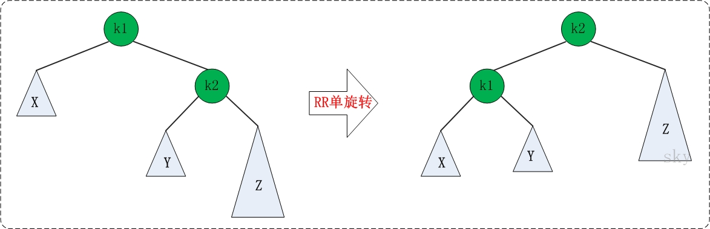

## 简介
+ B+树索引是B+树在数据库中的一种实现，是最常见也是数据库中使用最为频繁的一种索引。
+ B+树中的B代表平衡（balance），而不是二叉（binary），因为B+树是从最早的平衡二叉树演化而来的。
+ 学习B+树之前必须先了解二叉查找树、平衡二叉树（AVLTree）和平衡多路查找树（B-Tree），B+树即由这些树逐步优化而来。

## 1. 二叉查找树
+ 二叉树具有以下性质：左子树的键值小于根的键值，右子树的键值大于根的键值。 
+ 对二叉树的节点进行查找，深度为1的节点的查找次数为1，深度为2的查找次数为2，深度为n的节点的查找次数为n
+ 先通关计算平均查找次数进行评估性能
+ 二叉查找树可以任意地构造， 但是不同的结构的性能可能差别很大。

    > 此树的平均查找次数为 ：   (1+2+2+3+3+3) / 6 = 2.33次

    > 此树的平均查找次数为 ：   (1+2+3+4+5+5) / 6 = 3.33次

+ 因此，若想二叉树的查询效率尽可能高，需要这棵二叉树是平衡的。

## 2. 平衡二叉树（AVLTree）
+ 平衡二叉树（AVL树）在符合二叉查找树的条件下，还满足任何节点的两个子树的高度最大差为1
>    下图，左边是AVL树，它的任何节点的两个子树的高度差<=1；右边的不是AVL树，其根节点的左子树高度为3，而右子树高度为1；

+ 如果在AVL树中进行插入或删除节点，可能导致AVL树失去平衡。
>这种失去平衡的二叉树可以概括为四种姿态：LL（左左）、RR（右右）、**LR**（左右）、**RL**（右左）。它们的示意图如下： 

> **LL**：LeftLeft，也称“左左”。插入或删除一个节点后，根节点的左孩子（Left Child）的左孩子（Left Child）还有非空节点，导致根节点的左子树高度比右子树高度高2，AVL树失去平衡。
> **RR**：RightRight，也称“右右”。插入或删除一个节点后，根节点的右孩子（Right Child）的右孩子（Right Child）还有非空节点，导致根节点的右子树高度比左子树高度高2，AVL树失去平衡。
> **LR**：LeftRight，也称“左右”。插入或删除一个节点后，根节点的左孩子（Left Child）的右孩子（Right Child）还有非空节点，导致根节点的左子树高度比右子树高度高2，AVL树失去平衡。
> **RL**：RightLeft，也称“右左”。插入或删除一个节点后，根节点的右孩子（Right Child）的左孩子（Left Child）还有非空节点，导致根节点的右子树高度比左子树高度高2，AVL树失去平衡。

+ AVL树失去平衡之后，可以通过旋转使其恢复平衡
    > **LL**失去平衡的情况下，可以通过一次旋转让AVL树恢复平衡。步骤如下：
    > 1. 将根节点的左孩子作为新根节点。
    > 2. 将新根节点的右孩子作为原根节点的左孩子。
    > 3. 将原根节点作为新根节点的右孩子。

    > **RR**失去平衡的情况下，旋转方法与**LL**旋转对称，步骤如下：
    > 1. 将根节点的右孩子作为新根节点。
    > 2. 将新根节点的左孩子作为原根节点的右孩子。
    > 3. 将原根节点作为新根节点的左孩子。

    > **LR**失去平衡的情况下，需要进行两次旋转，步骤如下：
    > 1. 围绕根节点的左孩子进行**RR**旋转。
    > 2. 围绕根节点进行**LL**旋转。

    > **RL**失去平衡的情况下也需要进行两次旋转，旋转方法与**LR**旋转对称，步骤如下：
    > 1. 围绕根节点的右孩子进行**LL**旋转。
    > 2. 围绕根节点进行**RR**旋转。

[BTree.html]:https://www.cs.usfca.edu/~galles/visualization/BTree.html
[BPlusTree.html]:https://www.cs.usfca.edu/~galles/visualization/BPlusTree.html
## 3. 平衡多路查找树（B-Tree）
> B-Tree是为磁盘等外存储设备设计的一种平衡查找树.

> [点击进入BTree可视化操作][BTree.html] ， 演示如下：

## 4. B+Tree
下图为 MySql 的 B+Tree 结构：

> [点击进入B+Tree可视化操作][BPlusTree.html] ， 演示略：